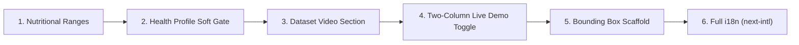

# Implementation Plan: MoM 1.1 — Web Application Front-End Changes

## Goal Description

Implement the **6 front-end features** specified in [Minutes_of_Meeting_EarthRenewal_AI.md](file:///d:/FYP%20workings/Agrovisoon/Minutes_of_Meeting_EarthRenewal_AI.md) section 1.1, with a deadline of **8 October 2026** (first draft) / **10 October 2026** (final).

The changes target the **Fruitelligence** Next.js 16 web app at [`frontend/`](file:///d:/FYP%20workings/Agrovisoon/frontend), which uses React 19, Tailwind CSS v4, Framer Motion, and Lucide icons.

---

## Summary of Decisions (from /grill-me Interview)

| # | Feature | Decision |
|---|---------|----------|
| 1 | **Nutritional Ranges** | Display values as `Lower – Upper` with a configurable `NUTRITION_RANGE_PERCENT` constant (default 10%) |
| 2 | **Health Profile Gate** | Pop-up modal opens when user tries to classify without a profile, preventing classification until completed and saved; persistent warning banner |
| 3 | **Dataset Video Section** | New standalone section between AI Classifier and BentoFeatures with a placeholder `<video>` element |
| 4 | **Two-Column Live Demo** | "View Live Demo" (desktop-only, hidden below `lg`) toggles a two-column layout: left = scrollable site with the classifier section still visible and showing results + health recommendation; right = sticky camera panel with an Exit button. Reversible, state preserved. |
| 5 | **Auto-Classify + Bounding Box** | In Live Demo, frames are classified automatically every 5s (no Classify tap). Right panel overlays a bounding box labelled `<class> · <confidence>%` (top-class probability, 0–100). Box is a mock centered box unless the API returns coordinates. |integration deferred |
| 6 | **i18n (EN/UR/AR)** | Full-page internationalization using `next-intl` with translations for Navbar, all sections, and Footer; language dropdown in Navbar with globe icon |

> [!IMPORTANT]
> README update is **excluded** from this plan per user request.

---

## Implementation Order

Incremental approach — each feature is built, verified (build check), then committed before moving to the next:



---

## Proposed Changes

### Phase 1: Nutritional Ranges

> Smallest, most isolated change. Affects only [`AIClassifierDemo.tsx`](file:///d:/FYP%20workings/Agrovisoon/frontend/src/components/sections/AIClassifierDemo.tsx).

#### [MODIFY] `AIClassifierDemo.tsx`

**1. Add configurable range constant** (top of file, ~line 60):

```typescript
/** ±percentage applied to nutritional values to display as a range */
const NUTRITION_RANGE_PERCENT = 10;
```

**2. Update `NutritionTable` component** (~line 317-362):

Currently displays single values:
```tsx
{row.value !== null ? `${row.value} ${row.unit}` : "—"}
```

Change to display ranges:
```tsx
function formatNutritionRange(value: number | null, unit: string): string {
  if (value === null) return "—";
  const factor = NUTRITION_RANGE_PERCENT / 100;
  const lower = +(value * (1 - factor)).toFixed(1);
  const upper = +(value * (1 + factor)).toFixed(1);
  return `${lower} – ${upper} ${unit}`;
}

// In render:
{formatNutritionRange(row.value, row.unit)}
```

**Visual result**: `Energy: 249.3 – 304.7 kcal` instead of `Energy: 277 kcal`

---

### Phase 2: Health Profile Gate

> Adds a pop-up modal and persistent warning banner when classifying without a health profile. Affects [`AIClassifierDemo.tsx`](file:///d:/FYP%20workings/Agrovisoon/frontend/src/components/sections/AIClassifierDemo.tsx).

#### [MODIFY] `AIClassifierDemo.tsx`

**1. Add state for the health profile warning**:

```typescript
const [showProfileWarning, setShowProfileWarning] = useState(false);
```

**2. Modify `handleClassify`** — at the start of the function, prevent classification and show the health profile popup if no profile exists:

```typescript
const handleClassify = async () => {
  // Gate: open profile modal and prevent classification until profile is saved
  if (!userProfile?.exists) {
    setShowProfileWarning(true);
    setProfileModalOpen(true);
    return;
  }
  
  // ... rest of existing classification logic unchanged
};
```

**3. Add dismissible warning banner** in the left column, above the "Classify" button:

```tsx
{showProfileWarning && !userProfile?.exists && (
  <div className="p-3.5 rounded-2xl bg-amber-50 border border-amber-200/50 flex items-start gap-3 animate-in fade-in slide-in-from-top-1 duration-200">
    <AlertCircle className="h-4 w-4 shrink-0 text-amber-600 mt-0.5" />
    <div className="flex-1">
      <p className="font-semibold text-xs text-amber-800">Health Profile Missing</p>
      <p className="text-[11px] text-amber-700 mt-0.5 leading-relaxed">
        Complete your Health Profile to receive personalized recommendations for each date variety.
      </p>
      <button
        type="button"
        onClick={() => setProfileModalOpen(true)}
        className="mt-1.5 inline-flex items-center gap-1 text-xs font-semibold text-amber-800 underline hover:text-amber-950 cursor-pointer"
      >
        Complete Health Profile Now &rarr;
      </button>
    </div>
    <button
      type="button"
      onClick={() => setShowProfileWarning(false)}
      className="p-1 text-amber-500 hover:text-amber-700 rounded-lg transition-colors cursor-pointer shrink-0"
      aria-label="Dismiss warning"
    >
      <X className="h-3.5 w-3.5" />
    </button>
  </div>
)}
```

**Behavior**: When clicking "Classify Date Variety" without a profile, the Health Profile questionnaire pop-up modal opens immediately and classification is prevented until the profile is completed and saved. If dismissed, the warning banner persists above the Classify button with a direct link to open the questionnaire. Once a profile is saved, the warning banner never shows and classification is permitted.

---

### Phase 3: Dataset Collection Video Section

> New standalone section. Requires a new component file and a page layout change.

#### [NEW] `DatasetVideo.tsx`

Create [`frontend/src/components/sections/DatasetVideo.tsx`](file:///d:/FYP%20workings/Agrovisoon/frontend/src/components/sections/DatasetVideo.tsx):

```tsx
"use client";

import React from "react";
import { Play, Film } from "lucide-react";
import SectionWrapper from "../layout/SectionWrapper";
import Container from "../layout/Container";

export default function DatasetVideo() {
  return (
    <SectionWrapper id="dataset-video" className="py-24 bg-background-light relative overflow-hidden">
      <Container>
        <div className="text-center max-w-3xl mx-auto mb-12">
          <p className="font-body text-xs font-bold text-accent uppercase tracking-widest">
            Behind the Scenes
          </p>
          <h2 className="font-display font-bold text-3xl sm:text-4xl text-primary mt-2">
            Dataset Collection Process
          </h2>
          <p className="font-body text-sm md:text-base text-foreground-muted mt-3">
            See how we collect, photograph, and annotate date fruit samples
            across Karachi&apos;s markets for our AI training pipeline.
          </p>
        </div>

        <div className="max-w-4xl mx-auto">
          <div className="relative rounded-3xl overflow-hidden border border-border/10 
                          bg-gradient-to-br from-primary/5 to-accent/5 shadow-sm aspect-video">
            {/* Placeholder video element */}
            <video
              className="w-full h-full object-cover"
              controls
              preload="metadata"
              poster="/placeholder-hero-orchard.jpeg"
            >
              {/* Swap src with actual video URL when available */}
              <source src="" type="video/mp4" />
              Your browser does not support the video tag.
            </video>

            {/* Overlay when no video source */}
            <div className="absolute inset-0 flex flex-col items-center justify-center 
                            bg-foreground/5 backdrop-blur-[2px] pointer-events-none">
              <div className="w-20 h-20 rounded-full bg-white/90 backdrop-blur-sm 
                              flex items-center justify-center shadow-lg border border-white/20">
                <Play className="h-8 w-8 text-primary ml-1" />
              </div>
              <p className="font-body text-sm font-semibold text-primary mt-4">
                Video Coming Soon
              </p>
              <p className="font-body text-xs text-foreground-muted mt-1">
                Dataset collection footage will be added here
              </p>
            </div>
          </div>
        </div>
      </Container>
    </SectionWrapper>
  );
}
```

#### [MODIFY] `page.tsx`

Insert the new section between `<AIClassifierDemo />` and `<BentoFeatures />`:

```diff
 import AIClassifierDemo from "@/components/sections/AIClassifierDemo";
+import DatasetVideo from "@/components/sections/DatasetVideo";
 import MarketplaceDemo from "@/components/sections/MarketplaceDemo";

 ...

         {/* AI Classifier Scanner Demo */}
         <AIClassifierDemo />

+        {/* Dataset Collection Video */}
+        <DatasetVideo />
+
         {/* Core Pillars Bento Grid */}
         <BentoFeatures />
```

---

### Phase 4: Two-Column Live Demo Toggle

> The most complex UI change. Adds a "View Live Demo" button that toggles the page into a split layout.

#### [NEW] `LiveDemoLayout.tsx`

Create [`frontend/src/components/layout/LiveDemoLayout.tsx`](file:///d:/FYP%20workings/Agrovisoon/frontend/src/components/layout/LiveDemoLayout.tsx):

This component wraps the entire page content and implements the two-column toggle:

```tsx
"use client";

import React, { useState, createContext, useContext } from "react";

interface LiveDemoContextType {
  isLiveDemo: boolean;
  toggleLiveDemo: () => void;
}

export const LiveDemoContext = createContext<LiveDemoContextType>({
  isLiveDemo: false,
  toggleLiveDemo: () => {},
});

export function useLiveDemo() {
  return useContext(LiveDemoContext);
}

interface LiveDemoLayoutProps {
  children: React.ReactNode;
  rightPanel: React.ReactNode;
}

export default function LiveDemoLayout({ children, rightPanel }: LiveDemoLayoutProps) {
  const [isLiveDemo, setIsLiveDemo] = useState(false);

  return (
    <LiveDemoContext.Provider value={{ isLiveDemo, toggleLiveDemo: () => setIsLiveDemo(prev => !prev) }}>
      {isLiveDemo ? (
        <div className="flex h-screen overflow-hidden">
          {/* Left: Scrollable site content */}
          <div className="flex-1 overflow-y-auto">
            {children}
          </div>
          {/* Right: Sticky camera + results panel */}
          <div className="w-[480px] xl:w-[540px] border-l border-border/10 bg-white 
                          overflow-y-auto flex-shrink-0 shadow-xl">
            {rightPanel}
          </div>
        </div>
      ) : (
        <>{children}</>
      )}
    </LiveDemoContext.Provider>
  );
}
```

#### [NEW] `LiveDemoPanel.tsx`

Create [`frontend/src/components/sections/LiveDemoPanel.tsx`](file:///d:/FYP%20workings/Agrovisoon/frontend/src/components/sections/LiveDemoPanel.tsx):

The right panel content — contains the camera feed and classification results in a compact vertical layout. This reuses the existing `CameraFeed` component and classification result display logic from `AIClassifierDemo.tsx`, refactored into shared subcomponents.

Key structure:
```
┌─────────────────────┐
│  🎥 Live Camera     │  ← CameraFeed component
│  [canvas overlay]   │  ← For bounding box (Phase 5)
├─────────────────────┤
│  Classification     │
│  Results            │  ← NutritionTable + variety info
│  (auto-refreshing)  │
├─────────────────────┤
│  Health Rec Banner  │
└─────────────────────┘
```

#### [MODIFY] `AIClassifierDemo.tsx`

Add the "View Live Demo" toggle button:

```tsx
import { useLiveDemo } from "../layout/LiveDemoLayout";
import { Monitor } from "lucide-react";

// Inside the component:
const { isLiveDemo, toggleLiveDemo } = useLiveDemo();

// Add button in the section header area:
<button
  type="button"
  onClick={toggleLiveDemo}
  className="flex items-center gap-2 px-4 py-2 rounded-xl border border-primary/20 
             bg-primary/5 text-primary font-body text-sm font-semibold 
             hover:bg-primary/10 transition-all cursor-pointer"
>
  <Monitor className="h-4 w-4" />
  {isLiveDemo ? "Exit Live Demo" : "View Live Demo"}
</button>
```

#### [MODIFY] `page.tsx`

Wrap the page content with `LiveDemoLayout`:

```diff
+import LiveDemoLayout from "@/components/layout/LiveDemoLayout";
+import LiveDemoPanel from "@/components/sections/LiveDemoPanel";

 export default function Home() {
   return (
-    <>
+    <LiveDemoLayout rightPanel={<LiveDemoPanel />}>
       <Navbar />
       <main className="flex-grow">
         ...
       </main>
       <Footer />
-    </>
+    </LiveDemoLayout>
   );
 }
```

---

### Phase 5: Live Detection Overlay & Classification

> The live camera uses the trained local date-gate YOLOv5n ONNX model in-browser. A mock detector is not used: if the model cannot load, the live workflow reports the error and does not classify a fabricated crop.

> **Date-detector data prerequisite:** The existing variety images have image-level class labels, not object boxes. Use the [local CVAT date-detection workflow](./date_detection_cvat_workflow.md) to annotate individual visible dates as one `date` class before training/exporting a compatible ONNX detector. The final overlay should merge detections into one union box; a mock fallback must not be presented as real detection.

#### [NEW] `scripts/copy-ort.mjs`
Adds a Node script that copies the necessary single-threaded WASM files from `node_modules/onnxruntime-web/dist/` into `public/ort/`. Added to `package.json` as a `postinstall` script.

#### [NEW] `useDateDetector.ts`
A custom hook that:
- Lazily loads `onnxruntime-web` and `public/models/date-detector.onnx`.
- Runs inference via a `requestAnimationFrame` loop on the video feed.
- Decodes YOLOv5 objectness and class scores, then applies non-maximum suppression.
- Reports model-load failures instead of emitting mock boxes.

#### [MODIFY] `CameraFeed.tsx`
Wraps the component with `React.forwardRef` to expose the `<video>` element, allowing the parent (`LiveDemoPanel`) to read frames for detection and cropping.

#### [MODIFY] `LiveDemoPanel.tsx`
- Adds a full-bleed `<canvas>` overlaid on top of the `<video>` element.
- The canvas draws the bounding boxes and their labels without triggering React re-renders.
- Requires three spatially consistent detector observations before verification.
- Starts a five-second countdown and samples date crops during that window; the highest-confidence crop is sent once to `/api/classify`.
- Uses the existing 224×224 classifier preprocessing and sends the classifier response to `liveResult`.
- Cancels the countdown if detections disappear and surfaces classifier/model errors with a retry path.

#### [MODIFY] `LiveDemoLayout.tsx` & `AIClassifierDemo.tsx`
- `LiveDemoLayout.tsx` extends context to include `liveResult` and `isLiveRetrying`.
- `AIClassifierDemo.tsx` renders a new block displaying the live result (using the existing `NutritionTable` and `RecommendationBanner`) when `isLiveDemo && liveResult` are true.

---

### Phase 6: Full i18n with `next-intl`

> Largest change. Adds internationalization to the entire website.

#### Install dependency

```bash
npm install next-intl
```

#### [NEW] Translation files

Create JSON translation files:

```
frontend/
├── messages/
│   ├── en.json    # English (source of truth)
│   ├── ur.json    # Urdu  
│   └── ar.json    # Arabic
```

**`en.json`** structure (excerpt):

```json
{
  "navbar": {
    "home": "Home",
    "varieties": "Varieties",
    "economicFootprint": "Economic Footprint",
    "healthUses": "Health & Uses",
    "demos": "Demos",
    "treeTracking": "Tree Tracking",
    "aboutUs": "About Us"
  },
  "hero": {
    "tagline": "Digitizing the Date Ecosystem",
    "title": "Fruitelligence",
    "subtitle": "Revolutionizing direct-to-consumer date trading..."
  },
  "classifier": {
    "sectionTag": "Interactive Demonstration",
    "title": "AI Date Variety Classifier",
    "description": "Upload an image of a date fruit...",
    "uploadTitle": "Upload Date Image",
    "classifyButton": "Classify Date Variety",
    "classifying": "Classifying Variety...",
    "setHealthProfile": "Set Health Profile",
    "updateHealthProfile": "Update Health Profile",
    "readyToClassify": "Ready to Classify",
    "viewLiveDemo": "View Live Demo",
    "exitLiveDemo": "Exit Live Demo"
  },
  "nutrition": {
    "title": "Nutritional Values · per 100 g",
    "minerals": "Minerals",
    "energy": "Energy",
    "carbohydrates": "Carbohydrates"
  },
  "healthProfile": {
    "title": "Health Questionnaire",
    "subtitle": "Personalises AI date recommendations",
    "q1Title": "Q1 — Blood Sugar",
    "q1Question": "Have you been diagnosed with diabetes..."
  },
  "datasetVideo": {
    "sectionTag": "Behind the Scenes",
    "title": "Dataset Collection Process",
    "description": "See how we collect..."
  }
}
```

**`ur.json`** and **`ar.json`** — Same keys with Urdu and Arabic translations respectively. For Urdu and Arabic, the layout direction will be set to RTL.

#### [NEW] `i18n/request.ts`

```typescript
import { getRequestConfig } from 'next-intl/server';
import { cookies } from 'next/headers';

export default getRequestConfig(async () => {
  const cookieStore = await cookies();
  const locale = cookieStore.get('locale')?.value || 'en';
  
  return {
    locale,
    messages: (await import(`../../messages/${locale}.json`)).default,
  };
});
```

#### [NEW] `i18n/routing.ts`

Configuration for supported locales.

#### [MODIFY] `next.config.ts`

Add the `next-intl` plugin:

```typescript
import createNextIntlPlugin from 'next-intl/plugin';

const withNextIntl = createNextIntlPlugin('./src/i18n/request.ts');

const nextConfig = {};

export default withNextIntl(nextConfig);
```

#### [MODIFY] `layout.tsx`

Wrap with `NextIntlClientProvider` and set `dir` attribute for RTL languages:

```tsx
import { NextIntlClientProvider } from 'next-intl';
import { getLocale, getMessages } from 'next-intl/server';

export default async function RootLayout({ children }) {
  const locale = await getLocale();
  const messages = await getMessages();
  const dir = ['ar', 'ur'].includes(locale) ? 'rtl' : 'ltr';

  return (
    <html lang={locale} dir={dir} className={...}>
      <body>
        <NextIntlClientProvider messages={messages}>
          <ServerKeepAlive />
          {children}
        </NextIntlClientProvider>
      </body>
    </html>
  );
}
```

#### [MODIFY] `Navbar.tsx`

Add language dropdown with globe icon:

```tsx
import { Globe } from "lucide-react";

// Language switcher in Navbar (right side, before hamburger):
<div className="relative">
  <button
    onClick={() => setLangOpen(!langOpen)}
    className="flex items-center gap-1.5 px-3 py-2 rounded-lg text-sm 
               font-medium text-primary hover:bg-primary/6 transition-colors cursor-pointer"
  >
    <Globe className="h-4 w-4" />
    <span className="uppercase text-xs font-bold">{currentLocale}</span>
  </button>
  {langOpen && (
    <div className="absolute right-0 mt-2 w-40 bg-white/95 backdrop-blur-md 
                    rounded-xl border border-border/10 shadow-lg py-1.5 z-50">
      {[
        { code: "en", label: "English", flag: "🇬🇧" },
        { code: "ur", label: "اردو", flag: "🇵🇰" },
        { code: "ar", label: "العربية", flag: "🇸🇦" },
      ].map(lang => (
        <button
          key={lang.code}
          onClick={() => switchLocale(lang.code)}
          className={`w-full text-left px-4 py-2.5 text-sm font-medium 
                      hover:bg-primary/5 transition-colors cursor-pointer flex items-center gap-3
                      ${currentLocale === lang.code ? "text-accent font-semibold" : "text-primary"}`}
        >
          <span>{lang.flag}</span>
          <span>{lang.label}</span>
        </button>
      ))}
    </div>
  )}
</div>
```

Language switching sets a cookie (`locale`) and triggers a page reload/revalidation.

#### [MODIFY] All section components

Replace hardcoded strings with `useTranslations()` calls:

```tsx
import { useTranslations } from "next-intl";

export default function Hero() {
  const t = useTranslations("hero");
  
  return (
    <h1>{t("title")}</h1>
    <p>{t("subtitle")}</p>
  );
}
```

> [!NOTE]
> For RTL languages (Urdu, Arabic), Tailwind's built-in RTL support via `dir="rtl"` on `<html>` will handle most layout flipping. CSS logical properties (`ms-*`, `me-*`, `ps-*`, `pe-*`) will be used where needed.

---

## Files Summary

| Action | File | Phase |
|--------|------|-------|
| MODIFY | [`AIClassifierDemo.tsx`](file:///d:/FYP%20workings/Agrovisoon/frontend/src/components/sections/AIClassifierDemo.tsx) | 1, 2, 4 |
| NEW | [`DatasetVideo.tsx`](file:///d:/FYP%20workings/Agrovisoon/frontend/src/components/sections/DatasetVideo.tsx) | 3 |
| NEW | [`LiveDemoLayout.tsx`](file:///d:/FYP%20workings/Agrovisoon/frontend/src/components/layout/LiveDemoLayout.tsx) | 4 |
| NEW | [`LiveDemoPanel.tsx`](file:///d:/FYP%20workings/Agrovisoon/frontend/src/components/sections/LiveDemoPanel.tsx) | 4, 5 |
| MODIFY | [`CameraFeed.tsx`](file:///d:/FYP%20workings/Agrovisoon/frontend/src/components/sections/CameraFeed.tsx) | 5 |
| MODIFY | [`page.tsx`](file:///d:/FYP%20workings/Agrovisoon/frontend/src/app/page.tsx) | 3, 4 |
| MODIFY | [`layout.tsx`](file:///d:/FYP%20workings/Agrovisoon/frontend/src/app/layout.tsx) | 6 |
| MODIFY | [`Navbar.tsx`](file:///d:/FYP%20workings/Agrovisoon/frontend/src/components/layout/Navbar.tsx) | 6 |
| MODIFY | [`next.config.ts`](file:///d:/FYP%20workings/Agrovisoon/frontend/next.config.ts) | 6 |
| NEW | `messages/en.json` | 6 |
| NEW | `messages/ur.json` | 6 |
| NEW | `messages/ar.json` | 6 |
| NEW | `src/i18n/request.ts` | 6 |
| MODIFY | All section components (Hero, BentoFeatures, etc.) | 6 |

---

## Verification Plan

### Automated Tests

After each phase:

```bash
cd d:\FYP workings\Agrovisoon\frontend
npm run build
```

### Manual Verification

| Phase | What to Check |
|-------|---------------|
| 1 | Nutritional table shows ranges (e.g., `249.3 – 304.7 kcal`) instead of single values |
| 2 | Classify without profile → amber warning banner appears; dismiss and re-classify → appears again; save profile → never shows |
| 3 | New "Dataset Collection Process" section visible between AI Classifier and BentoFeatures with placeholder video |
| 4 | "View Live Demo" button toggles two-column layout; left scrolls independently; right panel stays fixed with camera feed |
| 5 | Live camera runs the trained YOLOv5n detector, verifies a stable detection, counts down for five seconds, selects and crops the best frame, and displays one backend classification result |
| 6 | Language dropdown in Navbar; switching to Urdu/Arabic changes all text + page direction flips to RTL |

> [!WARNING]
> **Phase 6 (i18n)** is the highest-risk change as it touches every component. Urdu and Arabic translations should be reviewed by a native speaker before final submission on Oct 10.

> [!IMPORTANT]
> **Phase 4-5** refactor the classifier component. The manual flow must work identically with Live Demo off. Bounding box is a mock unless the API returns coordinates
